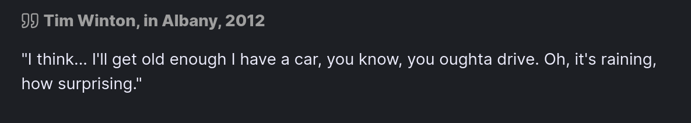
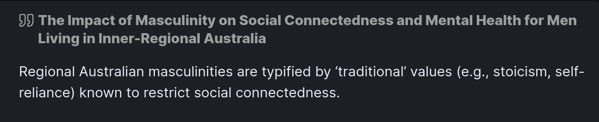
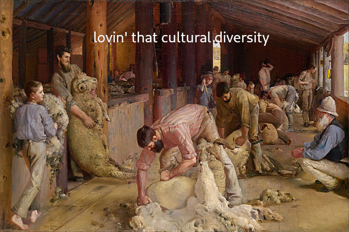
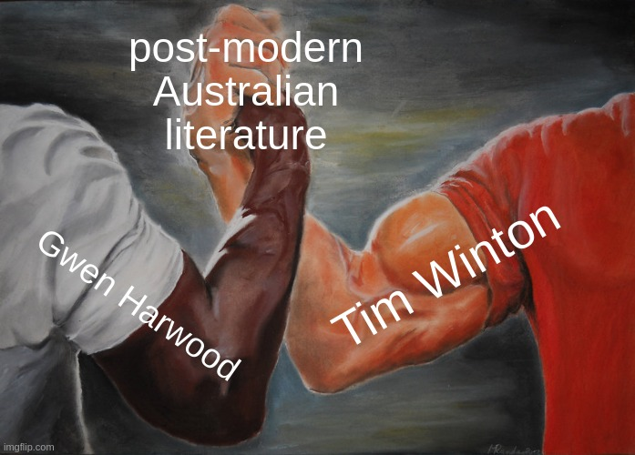

([From an ABC interview](https://www.youtube.com/watch?v=DbVQT4ouwzc))

Thanks, Timothy. Very much like Albany.

Tim Winton has a long record of making all sorts of contributions to literature, be it plays, prose texts, short stories, etc. Last year, he got [a pretty big award](https://www.gg.gov.au/sites/default/files/2023-07/KB23%20-%20Honours%20List%20-%20Order%20of%20Australia%20%28General%20and%20Military%20Divisions%29%20Inc%20CHEYNE%20%282%29.pdf) as well! But, alas, we are not here to talk about Cloudstreet, or Breath, instead I'm going to be talking about <u>The Turning</u> (2004). Which, in my *totally* humble opinion, ranks up there with his heavy hitters. 

<u>The Turning</u> is a pretty long anthology, so I'll definitely be talking about it again. But for now, I want to discuss my thoughts on just *two* of these short stories. <u>Damaged Goods</u> and <u>Long, Clear View</u>.

The majority of short stories about Vic Lang(*arguably the protagonist of the whole anthology*) is told by Vic himself. But not <u>Damaged Goods</u>. Instead, we are introduced to "the girl with the strawberry birthmark" mentioned in <u>Long, Clear View</u> from the perspective of Gail, Vic's wife. 

<u>Long, Clear View</u>, on the other hand, is narrated from the perspective of a young Vic Lang, who recounts the violence and crime that permeates life in Angelus. We learn that Vic's father, Bob, leaves the family, and the story ends with Vic clutching his father's rifle.

Personally, I think that Winton portrays life as a Western Australian through the perspective of Vic. In his portrayal of Angelus, Winton reflects on the violent, disjoint nature of regional Australian culture due to the lack of financial opportunities and social conflicts rooted in opposing identities. However, Winton's portrayal of Western Australian life is more nuanced, as he presents how the essence of Western Australian identity is interwoven with the influence of tragedy and loss.

With Tim Winton being a West Australian author and all, it's probably best to talk about some recurring themes in his literature that are Australian specific. The one that comes to mind when reading <u>Long, Clear View</u> and <u>Damaged Goods</u> is the concept of Australian masculinity. 

([From a NCBI article](https://www.ncbi.nlm.nih.gov/pmc/articles/PMC9734714/))

Throughout Australia's history, and most certainly through its literature, we get glimpses of the stereotypical "white Aussie bloke", the man of the house who struggles for the family, never showing any signs of weakness or vulnerability. Both of the short stories portray Vic as growing into this stereotype, and indicate that unstable, violent Australian society induces paranoia. Winton suggests that the unsafe social environment of rural Australia leads to the masculine traits we see from Vic, namely his fascination with defending himself and labouring for his family without complaint.

In <u>Long, Clear View</u>, we get all this negative talk coming from Vic, telling himself that he’s “not a baby” and that he should “shut up and stop bawling”. Clearly, Vic has some troubles being open and emotional, preferring instead to keep his anxiety and fears to himself. The harsh, deleterious vernacular Vic directs to himself is symptomatic of toxic masculine ideals of stoicism and self-hatred being rooted into Vic's personality.

When his dad leaves, Vic assumes the status of a father to his remaining family, and is able to “break two tons of mallee roots”, with his hands becoming as “leathery as a man’s”. With his father out of the picture, Vic’s childhood is cut short as he matures into being the man of the house. Winton points out how familial struggles that are commonplace in rural Australian households impose a toxic masculinity on young boys who are forced to grow up and deal with the harsh, labour-intensive lifestyle.

Now for the weird bit. Vic is... obsessive... to say the least, about a "Strawberry Alison" from his high-school. In <u>Damaged Goods</u>, Vic’s wife tells us that “the mark” Alison had since birth is “the root of [Vic’s] obsession” with her, leading him to "instinctively seek out a victim to defend". Through the 1st person perspective of Gail, we understand her dismay at Vic's desire to protect those he deems vulnerable. Winton further portrays Vic as victim to the masculine beliefs which make him overbearing and protective. Clearly, the trauma of losing his father, the death of his sister and growing up in a dangerous, rural Australian town has left Vic *pretty* messed up.

Near the end of the story, we discover that Alison and her girlfriend are “incinerated” after they “had hit a tree out on the coastal highway”. Alison predicts her own death through the poem she wrote in her final year of school. 

Perhaps this could be alluding to the title of Gwen Harwood's <u>Burning Sappho</u>? I mean, the similarities are pretty obvious. Alison writes a *poem*, about *two girls burning*. Alison becomes a "born-again lesbian", with the word "lesbian" being derived from her home island. And both Harwood and Winton are both classic Australian authors. I guess that means Vic's relationship with Alison was doomed from the beginning, with Gail recounting how Vic "dreamed of piling her into a car and tearing out of town". Vic charges himself with the duty to protect Alison, with the toxic masculine values of controlling and protecting women being kicked into full gear.

We are told that Vic “drove back out” to the tree and “thought of the crimson splash of flame Alison had sent forth”. Winton indicates how people have a heightened envisioning of the traumatic loss of their loved ones, through the emotive sensory imagery with which Gail recounts Vic's reaction. Clearly, Winton wants us to understand how the trauma inflicted onto people through the death of loved ones wounds them psychologically. For Vic, in particular, this results into a regression of his child-like masculine personality, which evolved out of his paranoia and fear of his childhood community.

Well, that's all I have to say about these two, peculiar short stories. Next time I'll be talking about the very 'unpleasant' marriage of Raelene and Max.

See you then!